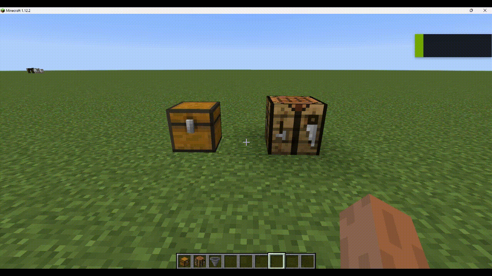
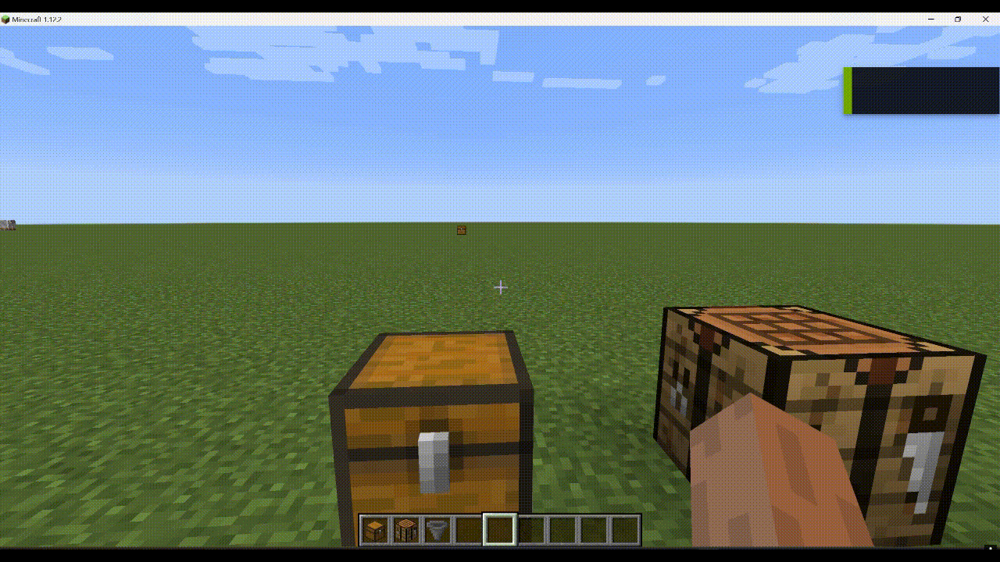
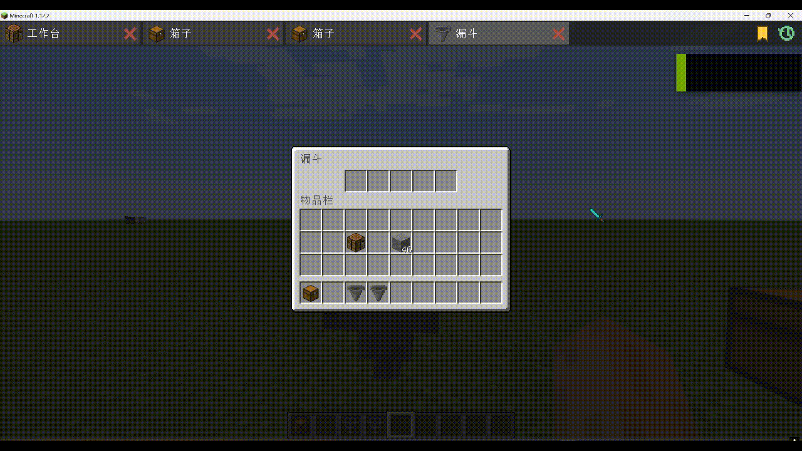

# GUI Browser

简体中文 | [English](#english)

---

## 模组

- 为 Minecraft 1.12.2 的 GUI 提供浏览器式外壳与会话管理

## 功能

- 将已打开的 GUI 统一纳入标签页管理，支持快速切换
- 支持历史记录、书签
- 兼容所有可交互的方块 GUI
- 提供了书签管理器，并可在界面中管理文件夹&书签

## 致谢

- 远程 GUI 交互机制部分参考了 [Pointer](https://github.com/CleanroomMC/Pointer) 项目，谢谢喵！

## 依赖

- 前置：[MixinBooter](https://github.com/CleanroomMC/MixinBooter)

## 下载

- 在 Release 页面下载

## 画廊

---

## English

## Mod

- Provides a browser-like shell and session management for GUIs in Minecraft 1.12.2.

## Features

- Organizes opened GUIs into tabs for quick switching
- Supports history, bookmarks
- Works with almost all interactive block GUIs and switches tabs in a container-aware way
- Provide bookmark manager, for managing folders & bookmarks

## Acknowledgment

- The remote GUI interaction was inspired by the [Pointer](https://github.com/CleanroomMC/Pointer) project

## Dependencies

- Required dependency: [MixinBooter](https://github.com/CleanroomMC/MixinBooter)

## Download

- Download from the Releases page

## Gallery

